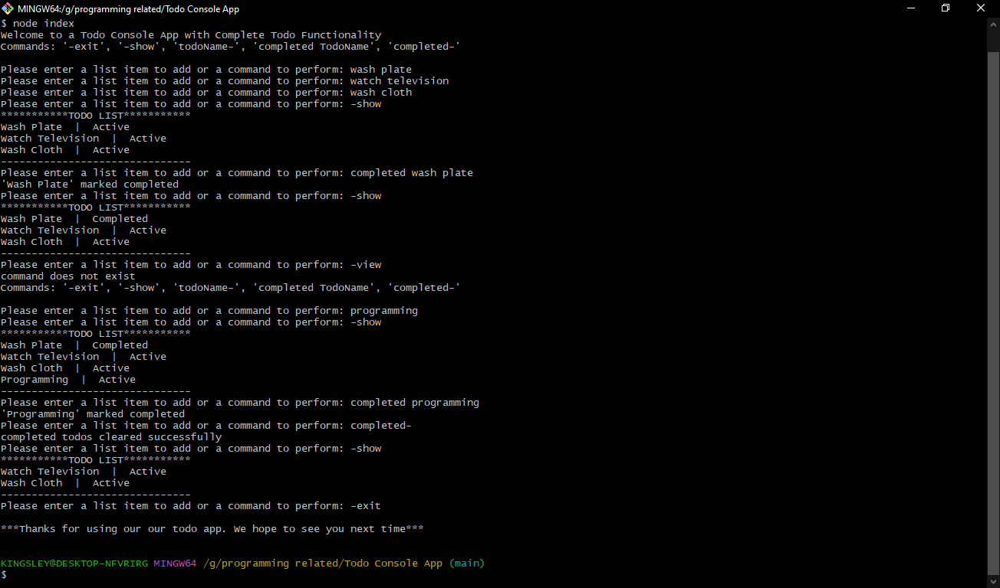

# Todo Console App

This is a working solution of a todo console app. is has the complete functionality of a todo app. A user can add new todo, view todos, delete todo, mark todo completed and also clear completed todos.



## Usage

- clone the repo and cd into the directory such that you are on `Todo Console App`
- To run the solution, make sure you have [nodejs](https://nodejs.org) installed
- use the following command terminal

```bash
npm start
or
node index.js
```

**_Note: To add a new task to to todos just type in the name of the task and press enter_**

## List of Commands

- **`-help`** : list all help commands and their usage
- **`-exit`** : terminate or exit application
- **`-show`** : list todos
- **`<todoName>-`** : deletes the todo
- **`completed-`** : clear completed todos
- **`completed <todoName>`** : mark the selected todo completed

Watch a sample below

```bash
➜  Todo Console App:(main) $ node index
Welcome to a Todo Console App with Complete Todo Functionality
Commands: '-help', '-exit', '-show', 'todoName-', 'completed TodoName', 'completed-'

Please enter a list item to add or a command to perform: -help

Usage:

-help                  list all help commands and their usage
-exit                  terminate or exit application
-show                  list all todos
completed-             clear completed todos
<todoName>-            delete the todo e.g 'watch movie-' removes the todo 'watch movie'
completed <todoName>   mark the todo completed e.g 'completed watch movie' marks 'watch movie' as completed

Please enter a list item to add or a command to perform: wash plate
Please enter a list item to add or a command to perform: watch television
Please enter a list item to add or a command to perform: wash cloth
Please enter a list item to add or a command to perform: completed wash plate

'Wash Plate' marked completed

Please enter a list item to add or a command to perform: -show
***********TODO LIST***********
Wash Plate  |  Completed
Watch Television  |  Active
Wash Cloth  |  Active
-------------------------------

Please enter a list item to add or a command to perform: -view
command does not exist
Commands: '-help', '-exit', '-show', 'todoName-', 'completed TodoName', 'completed-'

Please enter a list item to add or a command to perform: programming
Please enter a list item to add or a command to perform: completed programming

'Programming' marked completed

Please enter a list item to add or a command to perform: completed-

completed todos cleared successfully

Please enter a list item to add or a command to perform: -show

***********TODO LIST***********
Watch Television  |  Active
Wash Cloth  |  Active
-------------------------------

Please enter a list item to add or a command to perform: -exit

***Thanks for using our our todo app. We hope to see you next time***

```
